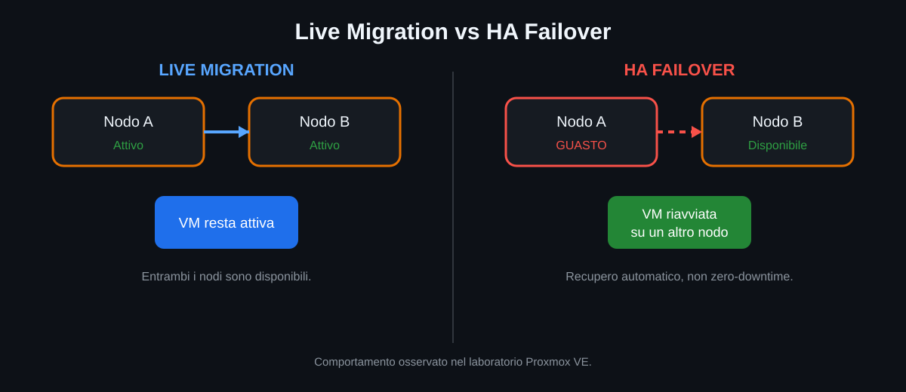
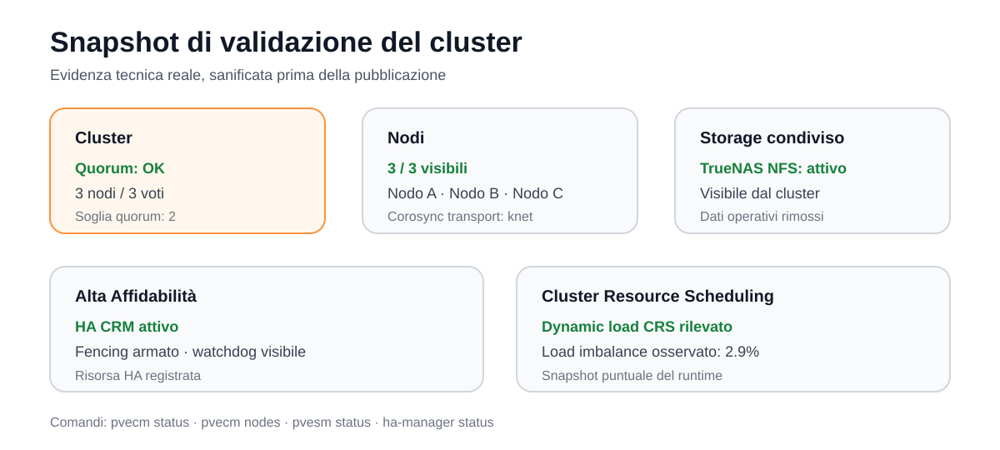

# Test di Alta Affidabilità

## Obiettivo

Il test HA voleva rispondere a una domanda pratica: cosa succede a una VM quando il nodo fisico che la esegue diventa improvvisamente indisponibile?

<p align="center">
  
</p>

## Scenario testato

1. Una VM è stata configurata come risorsa Proxmox HA.
2. La VM era in esecuzione su un nodo del cluster.
3. Il nodo fisico è stato spento per simulare un guasto improvviso.
4. Il cluster ha rilevato la perdita del nodo.
5. Proxmox HA ha riavviato la VM su un altro nodo disponibile.

## Risultato

Il test ha funzionato: il workload è stato recuperato automaticamente su un altro nodo.

La VM non ha continuato dal preciso stato RAM del server guasto. Quando un host si spegne improvvisamente, quello stato volatile non è più disponibile; il nodo superstite può riavviare la VM usando il disco condiviso.

## HA non significa zero downtime

- **Live migration:** spostamento pianificato tra due host sani.
- **HA failover:** recupero automatico dopo un guasto.

L'HA riduce il lavoro manuale e il tempo di ripristino, ma un guasto fisico improvviso può comunque causare un'interruzione del servizio.

## Snapshot runtime sanificato

La validazione reale ha mostrato:

- quorum OK;
- HA CRM attivo;
- fencing armato;
- watchdog visibile;
- una risorsa HA registrata;
- `dynamic load CRS` riportato dal sistema;
- load imbalance del 2.9% nel momento dello snapshot.

<p align="center">
  
</p>

## Quando il nodo guasto torna online

Il nodo rientra nel cluster, ma la VM recuperata su un altro host non deve necessariamente tornare subito al nodo originale. Il posizionamento può essere modificato in seguito con migrazione o policy HA.

## Comandi di verifica

```bash
ha-manager status
pvecm status
pvecm nodes
```

## Test futuri

- guasto di un nodo diverso;
- più risorse HA contemporaneamente;
- misurazione del tempo di recovery;
- indisponibilità storage;
- scheduler e bilanciamento con più workload attivi;
- backup e disaster recovery.