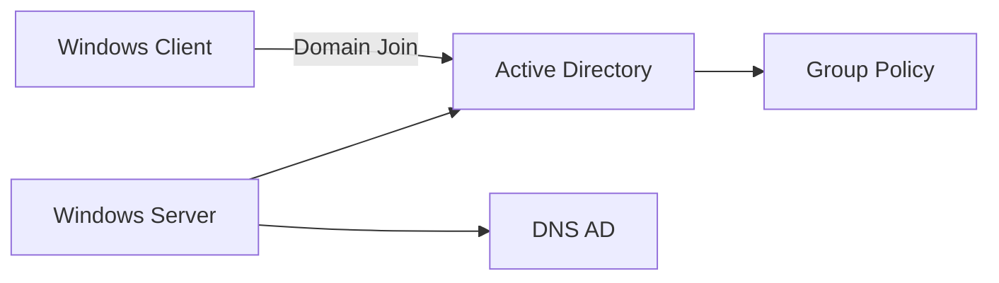

# Architettura del laboratorio

## Panoramica

Il laboratorio è costruito intorno a un cluster Proxmox VE a tre nodi con storage condiviso TrueNAS. L'obiettivo è studiare concetti reali di virtualizzazione e infrastruttura mantenendo una struttura abbastanza semplice da poter essere compresa, modificata e testata.

  

## Componenti principali

| Componente | Ruolo |
|---|---|
| Proxmox Nodo A | Cluster e workload |
| Proxmox Nodo B | Cluster e workload |
| Proxmox Nodo C | Cluster e workload |
| TrueNAS | Storage NFS condiviso |

Gli identificativi reali di rete e degli host non sono pubblicati.

## Livello cluster

I tre host partecipano allo stesso cluster Proxmox VE. Corosync gestisce membership e comunicazione tra nodi; il quorum consente al cluster di prendere decisioni in modo sicuro quando un nodo diventa indisponibile.

## Livello storage

TrueNAS fornisce storage raggiungibile da più nodi. Quando il disco di una VM è su storage condiviso, la VM può essere spostata tra host senza dover ricopiare ogni volta l'intero disco virtuale.

## Livello servizi

Il cluster ospita servizi e workload usati per fare pratica:

- Pi-hole per DNS e filtraggio
- WireGuard per accesso remoto
- Zabbix per monitoraggio
- pfSense per firewall e segmentazione
- n8n e Telegram/Python per automazione
- Ubuntu per amministrazione Linux
- Windows Server e Windows Client per il futuro laboratorio Active Directory
- VM dedicata ai test HA

## Accesso remoto

WireGuard viene usato per amministrare il laboratorio da remoto attraverso una VPN cifrata, evitando di esporre direttamente l'interfaccia di gestione Proxmox su Internet.

## Monitoraggio

Zabbix è il laboratorio di monitoraggio per host, risorse e servizi. La roadmap comprende disponibilità, CPU, memoria, storage, rete e alerting.

## Esperienza cloud collegata

In parallelo al laboratorio on-premises, utilizzo AWS EC2 per fare pratica con workload Linux e Security Groups.

## Progetto Windows previsto

Il prossimo progetto importante è un piccolo dominio Microsoft:

## Sicurezza della documentazione

La versione pubblica usa nomi generici. Non vengono inseriti IP pubblici, IP operativi reali, hostname reali, username, password, chiavi SSH/WireGuard, token o endpoint sensibili.