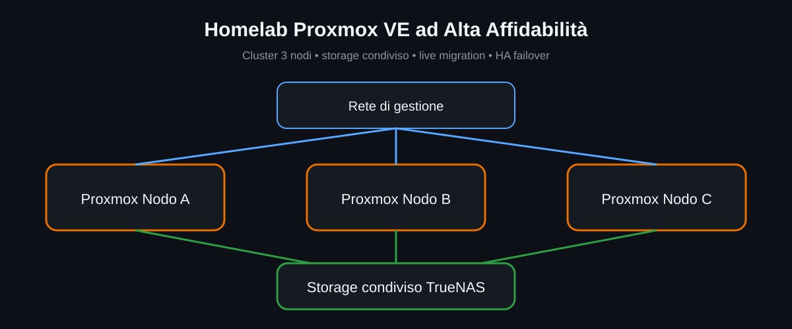

# Storage condiviso con TrueNAS

## Ruolo nel laboratorio

TrueNAS fornisce storage NFS raggiungibile dai nodi Proxmox. Il concetto chiave è che una VM con disco su storage condiviso non è legata al disco locale di un singolo host.

<p align="center">
  
</p>

## Perché è importante

Lo storage condiviso facilita:

- migrazione tra nodi;
- live migration più rapida quando non serve copiare il disco;
- recupero HA su un altro nodo;
- gestione centralizzata dello storage.

## Osservazione pratica

Durante i test, una migrazione con disco locale ha richiesto più tempo perché il disco virtuale doveva essere trasferito tra host. Con il disco già sullo storage condiviso, la migrazione è stata molto più veloce.

Questa è una lezione importante: **avere un cluster non significa automaticamente avere storage condiviso**.

## Verifica

```bash
pvesm status
```

La validazione sanificata conferma che lo storage NFS TrueNAS risultava attivo nel momento dello snapshot.

## Miglioramenti futuri

- rete dedicata allo storage;
- test prestazioni;
- test indisponibilità storage;
- backup e restore;
- monitoraggio capacità e latenza.

## Sicurezza

Non vengono pubblicate credenziali NFS, indirizzi reali, percorsi sensibili o configurazioni che espongano dettagli operativi dell'ambiente.