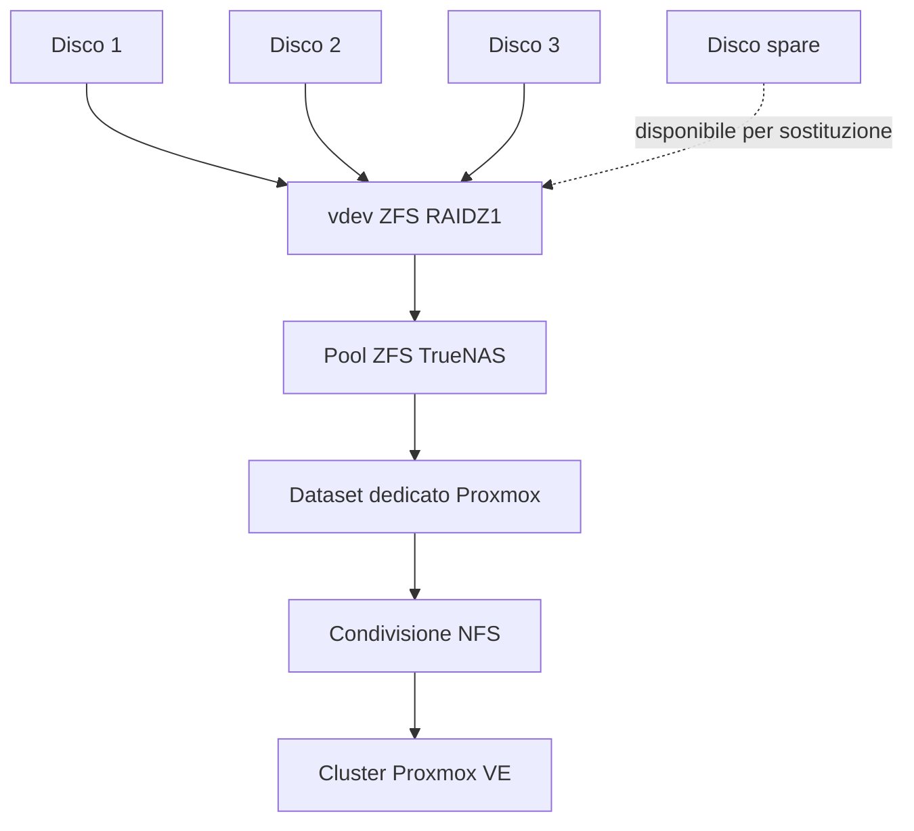

# Storage condiviso con TrueNAS

## Ruolo nel laboratorio

TrueNAS fornisce lo storage condiviso usato dal cluster Proxmox VE a tre nodi. L'obiettivo è mantenere i dischi delle VM raggiungibili da più host Proxmox, così migrazione e recupero HA non dipendono dal disco locale di un singolo nodo.

<p align="center">
  
</p>

## Configurazione TrueNAS attuale

Il pool utilizzato per il laboratorio Proxmox è configurato con:

- **3 dischi in un vdev RAIDZ1**
- **1 disco aggiuntivo configurato come spare**
- un **dataset dedicato allo storage Proxmox**
- esportazione del dataset tramite **NFS**
- aggiunta dello storage NFS in Proxmox come **storage condiviso** disponibile ai nodi del cluster



## Perché RAIDZ1 + spare

RAIDZ1 utilizza parità singola sul vdev a tre dischi e consente di tollerare il guasto di un disco appartenente al vdev.

Il disco spare **non aggiunge una seconda parità** e non trasforma RAIDZ1 in RAIDZ2. Il suo scopo è fornire un disco di sostituzione disponibile quando un membro del pool si guasta, riducendo il tempo necessario per riportare il pool alla configurazione prevista.

Questa configurazione è stata scelta per un laboratorio personale, con l'obiettivo di studiare ZFS, ridondanza, storage condiviso e procedure di recupero. Non viene presentata come configurazione universale per ambienti di produzione.

## Dataset e NFS

Per Proxmox utilizzo un dataset TrueNAS dedicato, separato dagli altri eventuali dati presenti sul NAS.

Il dataset viene esportato tramite NFS e aggiunto in Proxmox come storage condiviso. In questo modo i nodi del cluster possono accedere allo stesso storage delle VM.

## Perché è importante

Lo storage condiviso facilita:

- migrazione tra nodi;
- live migration più rapida quando non serve ricopiare il disco virtuale;
- recupero HA su un altro nodo, che può accedere allo stesso disco della VM;
- gestione centralizzata dello storage;
- studio pratico di ZFS, NFS e storage per virtualizzazione.

## Osservazione pratica

Durante i test, una migrazione con disco locale ha richiesto più tempo perché il disco virtuale doveva essere trasferito tra host. Con il disco già sullo storage NFS condiviso, la migrazione è risultata molto più veloce.

Questa è una lezione importante: **avere un cluster non significa automaticamente avere storage condiviso**.

## Verifica

```bash
pvesm status
```

La validazione sanificata conferma che lo storage NFS TrueNAS risultava attivo nel momento dello snapshot.

## Concetti di guasto e recupero

Questa configurazione mi permette anche di studiare:

- stato di salute del pool ZFS;
- parità RAIDZ1;
- stato degradato del pool;
- sostituzione di un disco e concetto di resilver;
- ruolo del disco spare;
- disponibilità NFS;
- impatto dello storage su migrazione e High Availability.

Un prossimo test utile sarà simulare in modo controllato la sostituzione di un disco, senza mettere a rischio dati importanti, e documentare il processo.

## Miglioramenti futuri

- rete dedicata allo storage;
- test prestazioni e latenza;
- monitoraggio dello stato ZFS;
- test controllato di sostituzione disco;
- test indisponibilità NFS;
- backup e restore.

## Sicurezza

Nel repository pubblico non vengono pubblicati:

- indirizzi reali dello storage;
- percorsi NFS non necessari alla spiegazione;
- username o password;
- chiavi SSH o WireGuard;
- API key, token o segreti;
- endpoint pubblici;
- configurazioni sensibili dell'ambiente.
