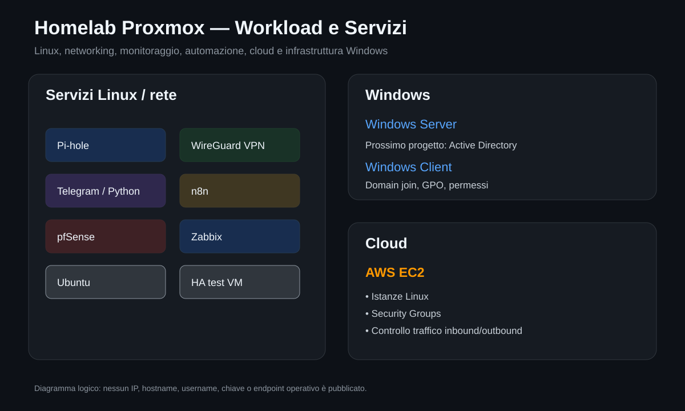

# VM, container e servizi

Questa pagina documenta i workload del laboratorio senza pubblicare ID interni, indirizzi IP, hostname o altri identificativi non necessari.

  

## Servizi Linux e infrastrutturali

| Workload | Tipo / utilizzo | Scopo |
|---|---|---|
| `pihole-ct` | Container Linux | DNS e filtraggio Pi-hole |
| `VPNWireguard` | Container Linux | Accesso remoto tramite WireGuard |
| `telegram-corner` | Container Linux | Automazione Telegram/Python |
| `n8n` | Container Linux | Workflow automation |
| `Zabbix` | VM | Monitoraggio infrastrutturale |
| `pfSense` | VM | Firewall e segmentazione |
| `Ubuntu` | VM | Test Linux e amministrazione |
| `ha-test` | VM | Test High Availability e failover |

## Pi-hole

Usato per fare pratica con:

- risoluzione DNS;
- configurazione DNS dei client;
- filtraggio a livello rete;
- disponibilità del servizio;
- monitoraggio.

## WireGuard VPN

Usato per:

- accesso remoto al laboratorio;
- configurazione peer;
- routing Linux;
- regole firewall;
- amministrazione remota;
- studio dei confini di sicurezza tra reti.

Nel repository non sono presenti chiavi WireGuard, endpoint pubblici o file di configurazione operativi.

## Zabbix

Il laboratorio Zabbix è usato per approfondire:

- disponibilità host;
- CPU e memoria;
- storage;
- servizi;
- rete;
- alerting;
- monitoraggio dei nodi Proxmox.

## pfSense

La VM pfSense viene usata per esperimenti di networking, firewall e futura segmentazione del laboratorio.

## Automazione

`telegram-corner` e `n8n` sono usati per fare pratica con applicazioni Linux, servizi, automazione e troubleshooting.

## Windows

Sono presenti un Windows Server e un client Windows per il prossimo laboratorio Active Directory.

Roadmap:

- Active Directory Domain Services;
- Domain Controller;
- DNS AD;
- utenti, gruppi e OU;
- Group Policy;
- domain join;
- permessi NTFS e share;
- secondo Domain Controller;
- replica;
- monitoraggio Zabbix;
- backup e restore.

## Cloud

In parallelo utilizzo AWS EC2 per fare pratica con workload Linux e Security Groups. I dettagli sono in [AWS EC2 e Security Groups](aws-ec2.md).

## Nota

La collocazione dei workload sui nodi può cambiare durante migrazioni e test HA. Per questo il repository descrive il ruolo dei servizi senza pubblicare informazioni operative inutili.